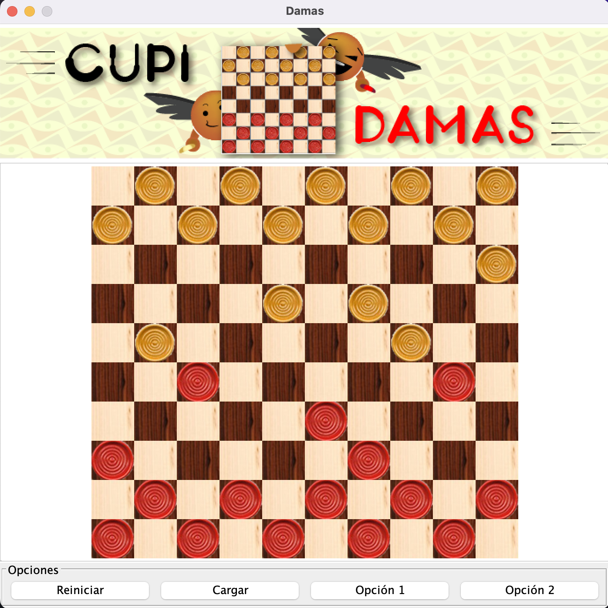

# Damas



## How to run

Compile and create jar

```sh
javac -encoding latin1 -d ./build -cp ".:lib/j3d-core-1.3.1.jar" $(find ./source/* | grep .java)
cd build
jar -cvfe damas.jar uniandes.cupi2.cupiDamas.interfaz.InterfazDamas uniandes/cupi2/cupiDamas/interfaz/*.class uniandes/cupi2/cupiDamas/mundo/*.class data/
java -jar damas.jar
```

